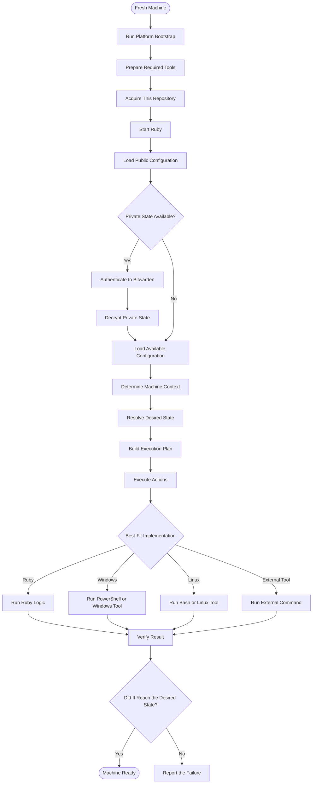
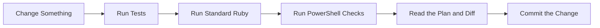

# How this is put together

This document exists because I do not want the architecture of this project to
live only in my head.

I have done a lot of this setup manually: install a few tools, copy or link a
few files, run a script, fix something, and eventually forget exactly what I
did. The purpose of this project is to make that process repeatable without
turning it into a huge framework.

It is also a Ruby learning project. Ruby is not here because every operation
needs to be written in Ruby. It is here because I want one place that can make
the decisions and direct the rest of the setup.

## Ruby is the director

Ruby is responsible for deciding:

- what kind of machine it is running on,
- which configuration applies,
- what the desired state is,
- which actions are needed, and
- whether those actions succeeded.

The action itself can still be implemented by whatever fits best. That might
be Ruby filesystem code, PowerShell, Bash, or an external command. The useful
boundary is not “everything must be Ruby”, but rather “Ruby decides what should
happen, and the best tool makes it happen.”

```text
Ruby decides what should happen.
The best-fit implementation performs it.
Ruby checks and reports the result.
```

## The broad flow



The diagram is intentionally about responsibilities rather than exact
commands. For example, it does not care whether Ruby calls `winget`, invokes a
PowerShell script, or uses a Ruby library. That is an implementation decision.

## The pieces

### Bootstrap

The bootstrap is the first small bridge onto a new machine. It installs or
enables enough tools to start the rest of the project, handles platform-specific
elevation, and acquires the repository.

After Ruby is available, the bootstrap should get out of the way. I do not want
the bootstrap script to slowly become a second configuration engine.

### Context

`Context` collects the facts that affect a run: the host operating system, the
Ruby version, the machine hostname, and the repository location. Keeping those facts in one object
means the rest of the code does not need to rediscover the platform everywhere.

### Desired state

`DesiredState` is the part that describes what I want the machine to look like.
It contains actions such as:

- link this public configuration file,
- copy this configuration file,
- run this command on Windows,
- install the tools described by the mise configuration, or
- load private and machine-specific actions from `private/actions.yml`.

The declarations are kept readable and ordered. Each action has a stable ID so
the plan can identify it later.

### Plan

`Plan` is the resolved set of actions for the current machine. Internally it is
keyed by action ID, which makes duplicate IDs an immediate error while keeping
the original insertion order for execution.

The `plan` command is deliberately read-only. It is there so I can see what
Ruby thinks it should do before allowing it to change anything.

### Executor

`Executor` turns the plan into actual machine changes and reports what happened.
For managed configuration, symlinks are usually the right answer because edits
made through the target path should continue editing the repository source.
Where files are copied instead, that is an intentional exception for applications
that do not tolerate symlinks well.

The executor is allowed to replace configuration that this repository manages.
That is intentional: the project is meant to establish the desired state of a
new machine. It should still refuse unrelated conflicts unless cleanup was
explicitly requested.

Command actions keep local state in `.local/state.json`. Their fingerprints
include the action definition and any declared input files, so a command can be
skipped when it has already run without silently ignoring a changed script or
configuration file.

### Platform implementations

Platform-specific code is not a failure of the architecture. PowerShell is the
natural place for Windows-native behavior, and Bash or other tools may be the
natural place for Linux behavior. Ruby still owns the decision to use them and
interprets the result afterward.

## Public and private state

Public configuration lives directly in the repository. `.gitconfig` is public
by design, including the configured Git identity.

Private state lives in `private/` while it is being edited and is stored in an
encrypted `private.age` archive for Git. The encryption workflow uses an
age identity retrieved from the Bitwarden note `dotfiles-age-keys`. The identity
itself never belongs in the repository.

When decrypted, private configuration can define actions in `private/actions.yml`.
Ruby reads this manifest, filters actions by platform and machine hostname, and
merges them directly into the desired state plan. This gives private actions the
same plan visibility, execution safety, and state tracking as public actions.

## Verification

The project is being built in small pieces, so verification is part of the
workflow rather than a final ceremony:



The goal is not to pretend the setup is perfect. The goal is to make each new
piece understandable enough that I can see what it does, verify it, and keep
building from there.
