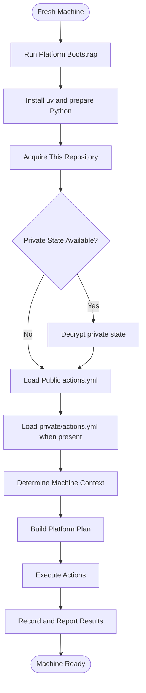

# How this is put together

This document records the project boundaries and the reason for each boundary.

The project stays small. `uv` prepares Python. Python resolves the action plan.
PowerShell, Bash, and external tools perform platform-specific work.

## Python is the director

Python is responsible for deciding:

- what machine it runs on,
- which actions apply,
- what each action means,
- which actions already reached the desired state, and
- what result to report.

The action implementation can use the best tool for the task. This keeps the
public setup readable without forcing every operation into Python.

```text
bootstrap -> uv -> Python -> action manifests -> plan -> executor
```

## The broad flow



## The pieces

### Bootstrap

The bootstrap installs uv with WinGet and starts the Python package with
`uv run`. It stays small so it does not become a second configuration engine.

### Context

`Context` stores the host operating system, Python version, hostname, and
repository path. Other modules use this object instead of rediscovering facts.

### Action manifests

`actions.yml` is the public extension point. It defines ordered action data
without Python code. `private/actions.yml` uses the same schema for private or
machine-specific actions.

An action declares its stable `id`, implementation `name`, human-readable
`description`, optional `platform`, optional `elevation`, and `parameters`.
Command actions can declare `inputs`. Their content becomes part of the local
execution fingerprint.

### Plan

`Plan` rejects duplicate IDs and preserves manifest order. It filters shared
and current-platform actions before execution.

### Executor

`Executor` implements the small set of supported action names. It protects
unmanaged files by default. The `--clean` option permits replacement of regular
files when the user requests it.

Command actions store successful fingerprints in `.local/state.json`. A changed
command input runs again. An unchanged action is skipped.

### Private state

The private workspace lives in `private/` during editing. The repository stores
only the encrypted `private.age` archive. The age identity comes from the
Bitwarden note `dotfiles-age-keys`.

Decryption never overwrites a non-empty private workspace. The private action
manifest is loaded only after the private workspace is available.

## Verification

Run the Python tests, Ruff checks, and PowerShell checks before committing:

```powershell
uv run pytest
uv run ruff check .
uv run ruff format --check .
pwsh -NoProfile -File scripts/PSFormat.ps1 -Check
pwsh -NoProfile -File scripts/PSLint.ps1
```
