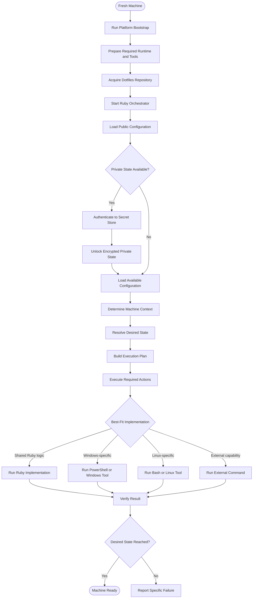

# Architecture

## Role of Ruby

Ruby is the primary orchestrator, or director, of the setup process. It owns the decisions about:

- what machine it is running on,
- which configuration is applicable,
- what the desired state should be,
- which actions are required, and
- how those actions should be coordinated and verified.

Ruby does not need to implement every action itself. An action may be implemented with Ruby filesystem APIs, PowerShell, Bash, or an external command when that is a better fit for the platform or tool involved.

The important boundary is responsibility, not language:

```text
Ruby decides what should happen.
The best-fit implementation performs it.
Ruby observes and reports the result.
```

## High-level flow



## Execution layers

### Bootstrap

The platform bootstrap is intentionally small. Its job is to prepare enough of the machine to start Ruby:

- install or enable required runtimes and tools,
- perform platform-specific elevation when necessary,
- acquire the repository, and
- start the Ruby entrypoint.

Bootstrap should not become the main configuration engine. Once Ruby is available, decisions about desired state belong in the orchestrator.

### Context

The context describes the runtime environment, including the host operating system, Ruby version, and repository location. It allows the same desired-state definition to select shared and platform-specific actions without embedding host detection throughout the codebase.

### Desired state

Desired state describes what the machine should look like. It should remain declarative where practical. A configuration action generally identifies:

- an action type,
- a human-readable description,
- parameters such as a source and target.

The action does not need to assume that every operation is a file copy. The parameters should describe the relationship required by the action, while the executor decides how that relationship is established.

### Plan

The plan is the resolved set of actions for the current context. The `plan` command is read-only and exists to make the orchestrator's decisions visible before applying them.

Platform filtering happens before execution so a Windows-only action is not sent to a Linux implementation, and shared actions remain reusable across platforms.

### Executor

The executor turns planned actions into machine changes and reports their results. For managed configuration links, the normal behavior is to create or maintain a symlink so edits made through the target path remain edits to the repository source.

Existing managed configuration may be replaced intentionally because the project is designed to establish a fresh machine's desired state. The executor should still refuse or clearly report unrelated conflicts unless the user explicitly requests cleanup behavior.

### Platform implementations

Platform-specific code is an implementation detail behind the plan. PowerShell is appropriate for Windows-native package management, services, registry operations, and Windows APIs. Bash or other native tools may be appropriate on Linux. Ruby remains responsible for coordinating these operations and interpreting their results.

## Public and private state

Public configuration is stored directly in the repository. `.gitconfig` is intentionally public configuration, including the configured Git identity.

Private state will be kept under `private/` and stored in encrypted form. Decrypted private files, credentials, keys, and machine-specific secrets must remain outside Git. Bitwarden is intended to provide access to encryption identities or other secrets without placing them in the repository.

## Verification and failure handling

Every meaningful action should either report a successful result or fail with a specific, actionable error. A partially applied machine should not be presented as ready.

The development workflow reinforces this boundary:


