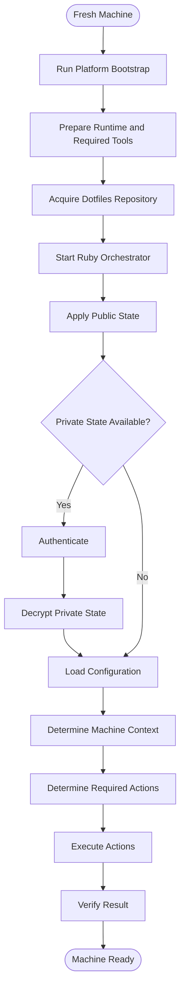

# Dotfiles Specification

**Status:** Draft

## Overview

This repository contains my personal cross-platform dotfiles and machine setup system.

It targets Windows and Linux and is intentionally custom rather than built around a full dotfiles framework.

Ruby is the primary orchestrator. PowerShell, Bash, and external tools may be used where they are the better fit for platform-specific work.

Ruby code is linted and formatted with RuboCop. The built-in `ruby -c` syntax check may also be used for a dependency-free syntax check.

## Goals

- Bootstrap a fresh Windows or Linux machine.
- Share common setup logic across platforms.
- Keep platform-specific behavior isolated where useful.
- Keep private configuration encrypted in the public repository.
- Keep machine-specific information private.
- Remain small, understandable, and fun to work on.

## Architecture



## Public and private state

The repository is assumed to be public.

Public state may include dotfiles, orchestration code, platform scripts, bootstrap scripts, documentation, and encrypted private data.

Private state may include machine definitions, hostnames, private configuration, private scripts, and sensitive machine-specific information.

When decrypted, private configuration can declare additional state changes in `private/actions.yml`. These actions use the same schema as public actions and support optional machine hostname targeting.

Private state must never be committed as plaintext.

## Encryption

Private files are stored as an encrypted archive in `private.age` in the repository root.

Decryption uses `age` with an identity key stored outside Git in Bitwarden under the note `dotfiles-age-keys`. The decrypted archive is extracted into `private/`.

```text
private workspace -> archive -> encrypt -> Git

Git -> decrypt -> extract -> private workspace
```

## Bootstrap

Platform bootstrap scripts should stay small.

Their job is to prepare enough of the environment to start the Ruby orchestrator.

## SSH signing

`dotfiles apply` may interactively prepare a machine-specific SSH signing key.
The setup may generate a local key, upload its public key to GitHub as a signing
key, and add the private key to the SSH agent. It must never delete existing
GitHub keys or store private keys in the repository.

## Platform behavior

Ruby owns shared orchestration and decides what needs to happen.

Individual actions may be implemented in Ruby, PowerShell, Bash, or external utilities depending on what is clearest.

## Safety

- Do not silently overwrite unrelated user files.
- Keep private plaintext, keys, secrets, and temporary decrypted data out of Git.
- Report failures clearly instead of presenting partial setup as success.

## Ruby tooling

RuboCop is the project's Ruby linter and formatter.

```text
bundle exec rubocop
bundle exec rubocop -a
```

Rules live in `.rubocop.yml` and stay small: the defaults plus a short list of
explicit project choices (tabs, line length, etc.). Individual exceptions
should remain local and justified.

## Deferred decisions

- Final repository layout.
- Ruby installation strategy on each platform.
